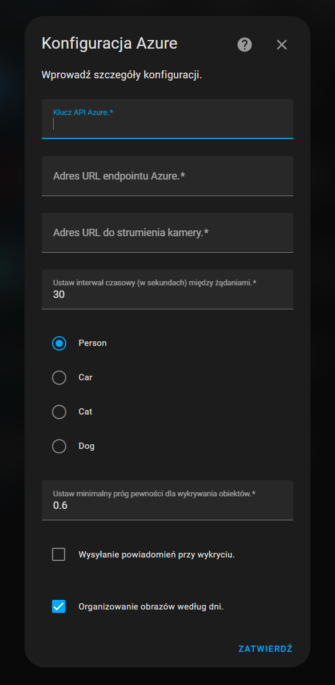

# HomeAIVision Integration for Home Assistant

Welcome to **HomeAIVision**! I'm here to make your home safer and smarter by bringing advanced AI vision capabilities right into your Home Assistant setup. Utilizing Azure Cognitive Services, I can analyze your home camera feed in real-time to detect human presence, ensuring that you only receive notifications that matter.

## Prerequisites

Before installing HomeAIVision, ensure you have:

- **Home Assistant Installation**: Running locally, on a device like a Raspberry Pi, or a VM. More details can be found [here](https://www.home-assistant.io/installation/).
- **Camera Setup**: Accessible via a URL, testable in a web browser. Ensure your camera stream is accessible from the network Home Assistant is on.
- **Azure Account**: Active account with an API key and endpoint URL from Azure Cognitive Services. [Get your API key here](https://portal.azure.com/).

## Installation

1. **Download the Integration**:
   - Visit the [GitHub repository](https://github.com/m-walas/HomeAIVision).
   - Click on the 'Code' button and select 'Download ZIP'. Extract the file.

2. **Install the Custom Component**:
   - Ensure a `custom_components` directory exists in your Home Assistant configuration directory (`/config`).
   - Copy the `homeaivision` folder from the extracted ZIP into the `custom_components` directory.

3. **Restart Home Assistant**:
   - This step is necessary to recognize the new integration. Restart via the server management page or restart the Home Assistant service.

4. **Add the Integration**:
   - Navigate to **Configuration** > **Integrations** in Home Assistant.
   - Click on **Add Integration** and search for **HomeAIVision**.
   - Fill in your Azure API key, endpoint URL, and camera URL as prompted. These can be obtained from your Azure Cognitive Services account.

## Configuration

### Initial Configuration
| Parameter                | Description                                           | Default |
|--------------------------|-------------------------------------------------------|---------|
| `azure_api_key`          | Azure Cognitive Services API key.                     |         |
| `azure_endpoint`         | Endpoint URL for Azure Cognitive Services.            |         |
| `cam_url`                | URL to access the camera feed.                        |         |
| `time_between_requests`  | Seconds between image requests.                       | `30`    |
| `send_notifications`     | Enable or disable notifications.                      | `False` |
| `organize_by_day`        | Organize saved images by day.                         | `True`  |
| `detected_objects`       | Select which objects to detect (e.g., person, car).   | `person`|
| `confidence_threshold`   | Minimum confidence threshold for detections.          | `0.6`   |

### Additional Options
| Parameter                | Description                                       | Default |
|--------------------------|---------------------------------------------------|---------|
| `max_images`             | Max images per folder or in total.                | `30`    |
| `days_to_keep`           | Days to keep images if organized by day.          | `7`     |
| `notification_language`  | Notification language.                            | `English` |

## Features

- **Human Detection**: Utilizes Azure Cognitive Services to identify human presence in the camera feed.
- **Notifications**: Alerts are sent to your devices upon detection to ensure you're always informed.
- **Image Saving**: Captures and saves images where human activity is detected, organizing them based on your settings.

## Troubleshooting

- **Verify Azure API and endpoint accuracy**: Ensure that your Azure credentials are correctly entered.
- **Check Camera Accessibility**: The camera URL must be accessible from your Home Assistant installation.
- **Review Logs**: Check the Home Assistant logs for errors related to this integration, which can provide clues for troubleshooting.

## Support the Project

If you like HomeAIVision and find it useful, consider giving it a ⭐ on [GitHub](https://github.com/m-walas/HomeAIVision)! Your support encourages further development and helps others discover the project.

Encounter issues or have suggestions? Please report them on our [Issues page](https://github.com/m-walas/HomeAIVision/issues). Your feedback is invaluable and helps improve HomeAIVision!

## License

This project is licensed under the MIT License - see the [LICENSE](LICENSE) file for details.